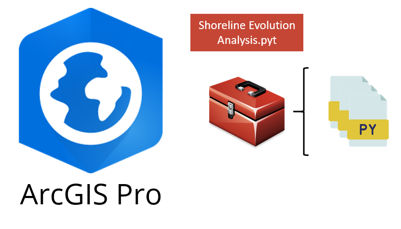
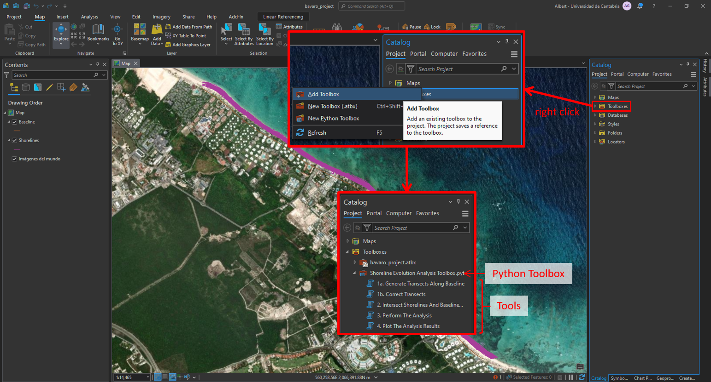
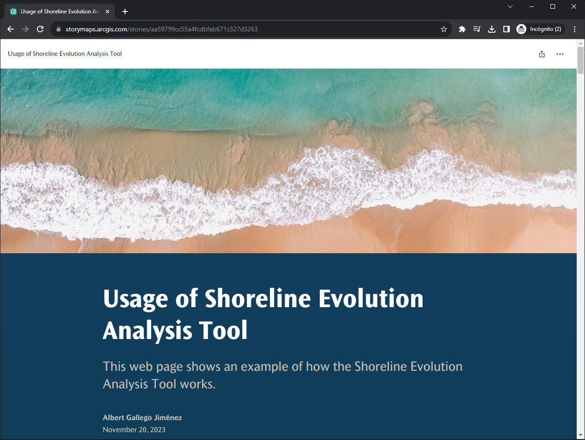

<a name="readme-top"></a>

<!-- PROJECT SHIELDS -->
[![Release][release-shield]][release-url]
[![LastCommit][lastcommit-shield]][lastcommit-url]

<!-- PROJECT LOGO -->
<br />
<div align="center">
  <a href="https://github.com/AlbertGallegoJimenez/shoreline-evolution-tool">
    
  </a>

<h3 align="center">SEATool (Shoreline Evolution Analysis Toolbox) 🌊🛰️</h3>

  <p align="center">
    This repository houses a set of tools that allow the user to perform simple and automated regression analysis of a given coastal zone, all integrated into ArcGIS Pro.
  </p>
</div>

<!-- ABOUT THE PROJECT -->
## About The Project

<div align="center">
  
</div>

The analysis methodology is simple but effective, it is based on the analysis of shoreline variations by segmenting the area into profiles and evaluating them with linear regressions.
This tool is developed as part of a [Python Toolbox](https://pro.arcgis.com/en/pro-app/latest/arcpy/geoprocessing_and_python/a-quick-tour-of-python-toolboxes.htm) for ArcGIS Pro. The tools that make up the toolbox are designed in a very intuitive way with an interface that is fully integrated seamlessly into ArcGIS Pro.


<!-- GETTING STARTED -->
## Getting Started

### Input data

In terms of data, this tool relies on the use of the following two files:
* <ins>**Baseline**</ins> (Vector - Polyline). This is the reference line used to assess the evolution of the coastal stretch. It can be digitized manually by the user with the help of a background orthophoto, taking care to place the baseline **inland** (behind all shorelines). The baseline must capture the general orientation of the coast.
* <ins>**Shorelines**</ins> (Vector - Polyline). These are the time series of the different shorelines on which the analysis will be based.
  * For the correct functioning of the tool, the file must have two required fields:
    * **Numeric ID**: A unique identifier for each shoreline
    * **Date**: in ISO 8601 format (`YYYY-MM-DD`, e.g., `2023-05-15`)

> [!WARNING]
> Note that both **Baseline** and **Shorelines** must be defined in a projected coordinate system.
> These layers must be stored as **Feature Classes in the Geodatabase** of the ArcGIS project.

### Installation

0. Make sure **you have cloned the base ArcGIS Anaconda environment** so you can install more packages. More info on how to clone the base environment [here](https://pro.arcgis.com/en/pro-app/latest/arcpy/get-started/clone-an-environment.htm).
1. **Download this repository** on your computer. You have two options:
   - **Via Git** (recommended): Open a terminal and run `git clone https://github.com/AlbertGallegoJimenez/SEATool`
   - **Direct download**: Click the green `<> Code` button at the top of this page, then select `Download ZIP` and extract it to your desired location.
2. Check that you have installed all the **required libraries** used in the toolbox. All packages with their tested versions are listed in [requirements.txt](https://github.com/AlbertGallegoJimenez/shoreline-evolution-tool/tree/main/requirements.txt). To install the packages, follow these steps:
   1. Open an Anaconda terminal and activate the cloned version of the ArcGIS Anaconda environment. (_If you don't have Anaconda installed on your computer, you can try to open the ArcGIS terminal located in "C:\Program Files\ArcGIS\Pro\bin\Python\Scripts\proenv.bat" or just type "Python Command Prompt" in the Windows search box and open this terminal_)
   2. Navigate to the main directory of your local clone of the repo and install the packages via pip:
      ``` shell
        cd path/to/SEATool
        pip install -r requirements.txt
      ```
3. Open the Catalog Pane in ArcGIS Pro and add the Python Toolbox (.pyt) to see the tools.
<div align="center">
  <a href="https://github.com/AlbertGallegoJimenez/shoreline-evolution-tool">
    
  </a>
</div>

<!-- USAGE -->
## Usage

For further details on how to run the different tools that make up the toolbox, a step-by-step guide is detailed [here](https://arcg.is/ez9KK0). The example for testing the tool is available in the [example](https://github.com/AlbertGallegoJimenez/shoreline-evolution-tool/tree/main/example) folder of the repository.

<div align="center">
<a href="https://arcg.is/ez9KK0">
  
</a>
</div>

<!-- CONTACT -->
## Contact

Albert Gallego Jiménez - [LinkedIn](https://www.linkedin.com/in/albert-gallego-jimenez) - agalleji8@gmail.com

Project Link: [https://github.com/AlbertGallegoJimenez/SEATool](https://github.com/AlbertGallegoJimenez/shoreline-evolution-tool)

<p align="right">(<a href="#readme-top">back to top</a>)</p>


<!-- MARKDOWN LINKS & IMAGES -->
<!-- https://www.markdownguide.org/basic-syntax/#reference-style-links -->
[release-shield]: https://img.shields.io/github/release/AlbertGallegoJimenez/shoreline-evolution-tool.svg?style=for-the-badge
[release-url]: https://github.com/AlbertGallegoJimenez/shoreline-evolution-tool/releases
[lastcommit-shield]: https://img.shields.io/github/last-commit/AlbertGallegoJimenez/shoreline-evolution-tool.svg?style=for-the-badge
[lastcommit-url]: https://github.com/AlbertGallegoJimenez/shoreline-evolution-tool/releases
