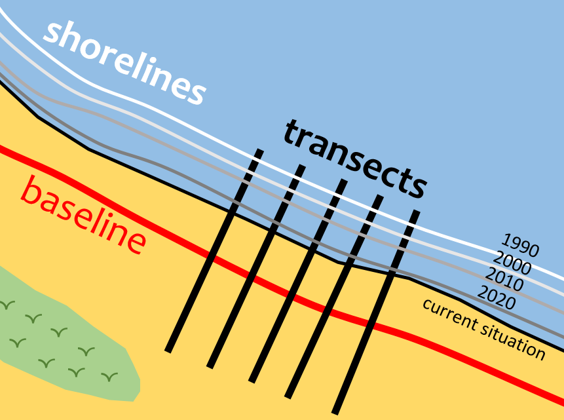

<a name="readme-top"></a>

<!-- PROJECT SHIELDS -->
[![Release][release-shield]][release-url]
[![LastCommit][lastcommit-shield]][lastcommit-url]

<!-- PROJECT LOGO -->
<br />
<div align="center">
  <a href="https://github.com/AlbertGallegoJimenez/shoreline-evolution-tool">
    
  </a>

<h3 align="center">Shoreline Evolution Analysis</h3>

  <p align="center">
    This repository houses a set of tools that allow the user to perform simple and automated regression analysis of a given coastal zone, all integrated into ArcGIS Pro.
    <br />
    <a href="https://github.com/AlbertGallegoJimenez/shoreline-evolution-tool/tree/main/src/tools"><strong>Explore the code »</strong></a>
    <br />
  </p>
</div>

<!-- ABOUT THE PROJECT -->
## About The Project

<div align="center">
  
</div>

The analysis methodology is simple but effective, it is based on the analysis of shoreline variations by segmenting the area into profiles and evaluating them with linear regressions.
This tool is developed as part of a [Python Toolbox](https://pro.arcgis.com/en/pro-app/latest/arcpy/geoprocessing_and_python/a-quick-tour-of-python-toolboxes.htm) for ArcGIS Pro. The tools that make up the toolbox are designed in a very intuitive way with an interface that is fully integrated seamlessly into ArcGIS Pro.


<!-- GETTING STARTED -->
## Getting Started

### Prerequisites
The following is a list of the programs and libraries used in the tool, with their respective versions:

* ArcGIS Pro - ```arcpy``` (version 3.1)
* ```pandas``` (version 1.4)
* ```numpy``` (version 1.20)
* ```shapely``` (version 2.0)
* ```statsmodels``` (version 0.13)

In terms of data, this tool relies on the use of the following two files:
* <ins>**Baseline**</ins> (Vector - Polyline). This is the reference line used to assess the evolution of the coastal stretch. It can be digitized manually by the user with the help of a background orthophoto, it is recommended to place the baseline **inland**. The baseline must capture the general orientation of the coast.
* <ins>**Shorelines**</ins> (Vector - Polyline). These are the time series of the different shorelines on which the analysis will be based.
  * For the correct functioning of the tool, the file must have a **numeric ID** and **date fields**.

### Installation

0. Make sure you have cloned the base ArcGIS' ```anaconda``` environment so you can install more packages. More info [here](https://pro.arcgis.com/en/pro-app/latest/arcpy/get-started/clone-an-environment.htm).
1. Install both ```shapely``` and ```statsmodels``` packages.
2. Download the content in the [src](https://github.com/AlbertGallegoJimenez/shoreline-evolution-tool/tree/main/src) folder.
3. Open the Catalog Pane in ArcGIS Pro and open the downloaded Toolbox (.pyt) to see the tools.
<div align="center">
  <a href="https://github.com/AlbertGallegoJimenez/shoreline-evolution-tool">
    
  </a>
</div>

<!-- USAGE -->
## Usage

For further details on how to run the different tools that make up the toolbox, a step-by-step guide is detailed [here](https://arcg.is/ez9KK0). The example for testing the tool is available in the [example](https://github.com/AlbertGallegoJimenez/shoreline-evolution-tool/tree/main/example) folder of the repository.

<div align="center">
<a href="https://arcg.is/ez9KK0">
  
</a>

*The platform used to develop the website is ArcGIS StoryMaps, if you are interested in more details click [here](https://www.esri.com/en-us/arcgis/products/arcgis-storymaps/overview).*
</div>

<!-- CONTACT -->
## Contact

Albert Gallego Jiménez - [LinkedIn](https://www.linkedin.com/in/albert-gallego-jimenez) - agalleji8@gmail.com

Project Link: [https://github.com/AlbertGallegoJimenez/shoreline-evolution-tool](https://github.com/AlbertGallegoJimenez/shoreline-evolution-tool)

<p align="right">(<a href="#readme-top">back to top</a>)</p>


<!-- MARKDOWN LINKS & IMAGES -->
<!-- https://www.markdownguide.org/basic-syntax/#reference-style-links -->
[release-shield]: https://img.shields.io/github/release/AlbertGallegoJimenez/shoreline-evolution-tool.svg?style=for-the-badge
[release-url]: https://github.com/AlbertGallegoJimenez/shoreline-evolution-tool/releases
[lastcommit-shield]: https://img.shields.io/github/last-commit/AlbertGallegoJimenez/shoreline-evolution-tool.svg?style=for-the-badge
[lastcommit-url]: https://github.com/AlbertGallegoJimenez/shoreline-evolution-tool/releases
